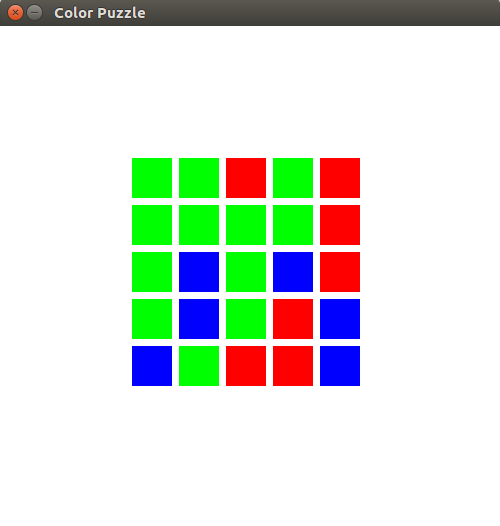

# Color-Puzzle
Its a game written in Pygame, whose objective is to convert all the colored blocks to the same color

There will be three kind of colors here, red, red green and blue. On clicking the red block it will turn green, on clicking green it will turn blue and on clicking blue, it will turn red. We need to convert the whole grid of the boxes in to a same color either red, blue or green.

